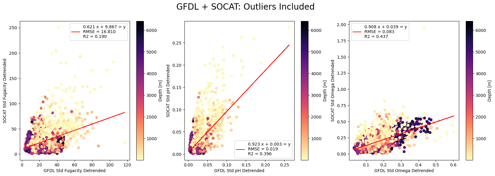
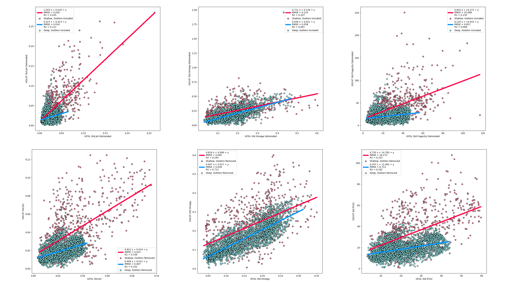
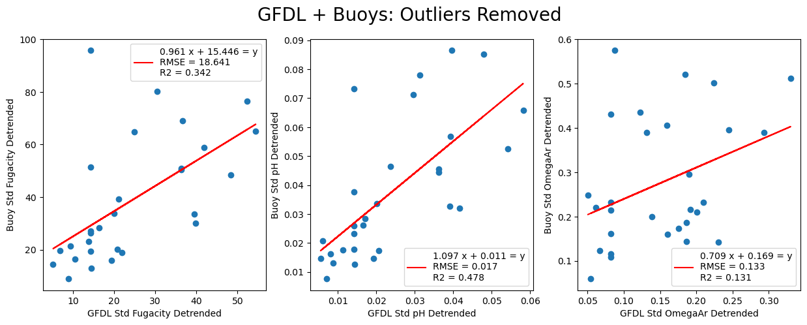
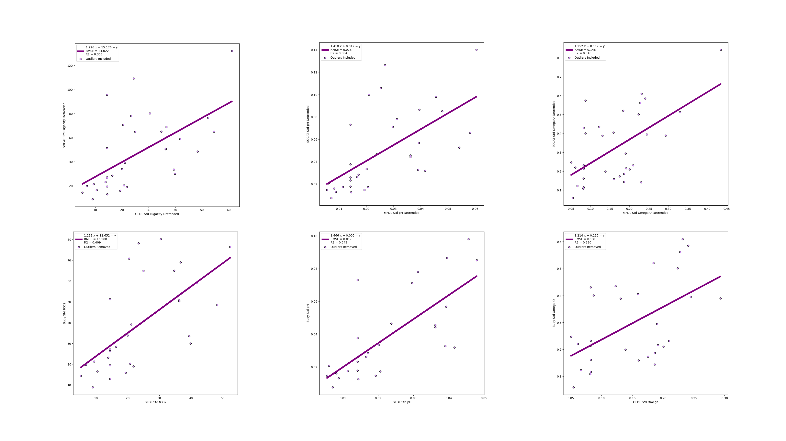

# Model Retrieval 

# `GFDL-ESM4.gr.historical.Omon.r1i1p1f1`

The selected CMIP6 model is GFDL-ESM4 (Dunne et al., 2020; Stock et al., 2020). It has been regridded onto a 1°x1° lat-lon grid. The `historical` experiment on the `Omon` table runs from 1-15-1850 to 12-15-2014 with data provided monthly. I have selected the first ensemble member, `r1i1p1f1`, as that is the only one provided.

Model output was retrieved and processed on Pangeo [(Abernathy et al., 2021, Computing in Science and Engineering)](https://par.nsf.gov/servlets/purl/10287683) with a variety of key open-source Python packages. All these packages are preinstalled on the Pangeo platform.
* `xmip` [(Busecke, 2021)](https://cmip6-preprocessing.readthedocs.io/en/latest/)
* `xesmf` [(Zhuang, 2020)](https://xesmf.readthedocs.io/en/v0.6.3/)
* `xarray` (Hamman & Hoyer, 2017, J. Open Research Software)
* `PyCO2SYS`(Humphreys et al., 2022, Geosci. Model Dev.)
* `gsw` (McDougall & Barker, 2011, Scor/Iapso WG)


## Variables

I selected the following variables which are surface variables. 
* `talkos`: Total Alkalinity [mol m-3]
* `sos`: Sea Surface Salinity [0.001]
* `phos`: ph [Total Scale]
* `tos`: Sea Surface Temperature [degC]
* `dissicos`: Dissolved Inorganic Carbon Concentration [mol m-3]

### Calculated Variables

Some variables are either in inconvenient units or not provided in the model. To convert from mol m-3 to umol kg-1, I first calculated density as potential density referenced to the surface using the `gsw` package and then used density as part of a conversion factor `conv`:
```python
ds['sigma0'] = gsw.sigma0(ds['sos'],ds['tos'])

conv = 1e6/(1000 + ds['sigma0'])
```
Fugacity and Omega_arag were not provided by the model. I calculated these using DIC, TA, temperature, and salinity, using `PyCO2SYS`. I based this method on [Terhaar et al. (2021, Biogeosciences)](https://bg.copernicus.org/articles/18/2221/2021/bg-18-2221-2021-discussion.html).

```python
results = pyco2.sys(par1=ds['talk']*conv,par2=ds['dissic']*conv,
                       par1_type=1,par2_type=2, salinity = ds['sos'], temperature = ds['tos'])
``` 
## Detrending Data

As of 6 May 2023 I am detrending from 2000 *only for present data* as it applies to variability.

The manuscript suggests detrending "1.89 µatm yr-1 for fCO2, -0.0018 yr-1 for pH and -0.0078 yr-1 for Ω from 1980s to 2010s (Bates et al., 2014)." For the model and for updated SOCAT data, I referenced to 1980, as suggested by the manuscript. The detrending in the model data is done as follows:

```python
ds['fugacity_detrended'] = (ds['fugacity'] -  1.89 * (ds['fugacity'].time.dt.year - 2000)) * xr.ones_like(ds['talk'])
ds['ph_detrended'] = (ds['ph'] + 0.0018 * (ds['ph'].time.dt.year - 2000)) * xr.ones_like(ds['talk'])
ds['omega_detrended'] = (ds['omega'] + 0.0078 * (ds['omega'].time.dt.year - 2000)) * xr.ones_like(ds['talk'])
```
SOCAT detrending done as follows:

```Matlab
REF_YEAR = 2000;
tem2_lon_lat(:,SOCAT.fCO2rec_detrended)=tem2_lon_lat(:,SOCAT.fCO2rec)-1.89*(tem2_lon_lat(:,SOCAT.yr)-REF_YEAR);
tem2_lon_lat(:,SOCAT.pH_detrended)=tem2_lon_lat(:,SOCAT.pH)+0.0018*(tem2_lon_lat(:,SOCAT.yr)-REF_YEAR);
tem2_lon_lat(:,SOCAT.OmegaAr_detrended)=tem2_lon_lat(:,SOCAT.OmegaAr)+0.0078*(tem2_lon_lat(:,SOCAT.yr)-REF_YEAR);
```

Buoy detrending done as follows:
```python
df['fCO2_detrended'] = (df['fCO2'] -  1.89 * (df['datetime'].dt.year - 2000)) 
df['ph_detrended'] = (df['pH_sw'] + 0.0018 * (df['datetime'].dt.year - 2000)) 
df['OmegaAr_detrended'] = (df['OmegaAr'] + 0.0078 * (df['datetime'].dt.year - 2000)) 
```

## Time Selection
Only after calculating new variables and detrending the data did I take a mean and standard deviation over time. 

### Present: 1-15-1995 to 12-15-2014

I selected the last 20 years of the model. Using the historical simulation.

### Past: 1-15-1850 to 12-15-1879

For a reconstruction of the past, I took decadal means from 1850 to 2000 and saved those to a local dataset.

### Future

SSP experiments on `Omon` tables start at 1-15-2015 are initialized from the historical experiment, so they form a continuous record, but their forcings are not based on observation.

There are multiple SSPs to choose from. SSPs are first categorized by scenario numbers 1 through 5, with SSP1 being the most sustainable model, SSP2 being a middle of the road model, SSP3 being a model characterized by regional rivalry, SSP4 being a model characterized by widespread inequity, and SSP5 being a model of continued fossil-fuel development. 

The SSP is then further characterized by a 2100 climate forcing similar to the previous RCPs: 2.6 W/m2, 4.5 W/m2, 7.0 W/m2, and 8.5 W/m2. Models are required to publish "Tier 1" experiments, which are SSP5-8.5, SSP3-7.0, SSP2-4.5, and SSP1-2.6. Further description of the SSP experiments can be found in [O'Neill et al. (2016, Geosci. Model Dev.)](https://gmd.copernicus.org/articles/9/3461/2016/).

So far, I have monthly future data from the `ssp245` run beginning in 2015 until 2060.

# SOCAT

## Updated SOCAT retrieval

I updated the SOCAT processing script (MATLAB) written by Hongjie (`VAR_SOCAT_test.m`). The changes largely reflect updates in the CO2SYS MATLAB package. This means we added arguments for NH4 and H2S, both of which are set to 0 in this context. As well, we added arguments for the boron-to-salinity ratio, set to `2` to reference Lee 2010, and for the KHF dissociation constant, set to `2` to reference Perez & Fraga, 1987. The updated CO2SYS uses filler values of -999, so we added in a line that checks for negative values of key CO2SYS outputs and replaced those with `NaN`.

The use of the deprecated CSIRO package in LIAR remains.

## Restructured SOCAT data for Python

I restructured the SOCAT data calculated by Hongjie using `xarray` to make the structure more similar to the model output. As part of this restructuring, I had to adjust latitude and longitude. The model's lat-lon points are half-degrees (i.e. -89.5, -88.5, -87.5, etc.), whereas SOCAT's lat-lon points are whole degrees (i.e. -90, -89, -88, etc.). So I could compare like grid cells, I added 0.5 to SOCAT's coordinates. This may cause a slight error, but I content the error is minimal and otherwise hard to avoid, as the model does not provide data on the exact coordinates as SOCAT.


# [Buoy Data](https://www.ncei.noaa.gov/access/ocean-carbon-acidification-data-system/oceans/Moorings/ndp097.html)

Buoy data retrieval is done in `buoydata_retrieval_dev.ipynb`. The buoy data had to be broken up into 2 sets. The first is buoy data with pCO2 AND pH. This is sufficient data to calculate fCO2 and OmegaAr using `PyCO2SYS`. The second is buoy data with pCO2 but NO pH. In order to solve for fCO2 and OmegaAr, we need at least 1 more carbonate system parameter. Thus, we used the [LIAR method](https://github.com/BRCScienceProducts/LIRs) from [Carter et al., 2017](https://aslopubs.onlinelibrary.wiley.com/doi/full/10.1002/lom3.10232). Summary data are written to a Google sheet in the Wang Lab shared drive. Granular data were saved locally due to file size.

# Adjusted Natural Variability in GFDL

## Combined Data
In order to adjust the globally resolved "natural variability" of our 3 metrics (pH, Omega, and fugacity) from GFDL, we compare the detrended standard deviation of each metric from (A) both SOCAT (across all available time, meeting certain data requirements outlined in the manuscript) and GFDL (inclusive of all monthly data from 1995-2015 in the historical simulation), and from (B) PMEL buoys (across all available time, meeting certain data requirements outlined in the manuscript) and GFDL (inclusive of all monthly data from 1995-2015 in the historical simulation). The data were compiled into 2 CSVs. The first (`GFDLESM4_SOCAT_June25.csv`) gives the SOCAT standard deviation of pH, Omega, and fugacity and the GFDL standard deviation of pH, Omega, and fugacity at each coordinate point where both SOCAT and GFDL data existed. This is to say, much of the GFDL data was omitted, since it had no SOCAT data for comparison. The variability in the SOCAT data, as of 3 July 2023, was taken from daily means in each grid cell, in an effort to make the scalesof variability between the SOCAT data and the GFDL data comparable. This results in a negligible difference in the data, as for each day in each grid cell, so few measurements are available. Similarly, the second dataset (`allbuoys_GFD_June18.csv`) gives the PMEL buoy standard deviation of pH, Omega, and fugacity and the GFDL standard deviation of pH, Omega, and fugacity at each coordinate point where both PMEL buoy and GFDL data existed. This is to say, the dataset only includes the ~30 coordinate points where buoy data was available.

## Linear Correlation Between SOCAT and GFDL-ESM4 
The calculated variabilities for each of our 3 carbonate parameters in SOCAT (dependent variable) was linearly correlated with the same for GFDL-ESM4 (independent variable). The points were colormapped with total ocean depth, as represented by GFDL-ESM4, as a quick and dirty proxy for coastal and ocean locations. Outliers were not removed. Thus, these correlations include all of the data. The $R^2$ values for fCO2, pH, and Ω are, respectively, 0.19, 0.396, and 0.437.

 

I then divided the data by depth. "Shallow" indicates locations where total depth is less than 1500 meters. "Deep" indicates locations where total depth is greater than 1500 meters. Independent linear correlations were done for shallow and deep locations. No outliers were removed yet. The strength of the correlations improved for (A) shallow pH, (B) deep Ω, and (C) shallow fugacity. The strength of the correlations weakened for (A) deep pH, (B) shallow Ω, and (C) deep fugacity.

Then, I attempted to remove outliers for the shallow and deep correlations. I excluded any data points where Cook's distance exceeded three times the mean Cook's distance. The strength of the correlations modestly improved with the omission of outliers for (A) deep pH, (B) deep fCO2, (C) shallow Ω, and (D) deep Ω. The strength of the correlations worsened with the omissions of outliers for (A) shallow pH and (B) shallow fCO2.



## Linear Adjustment






